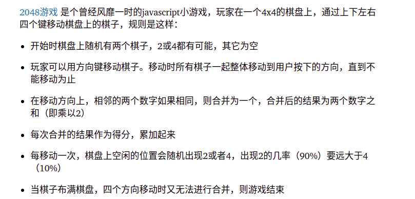
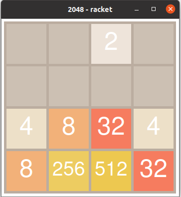

[toc]


## 前言

在这之前，我们需要：[Quick: An Introduction to Racket with Pictures](https://blog.csdn.net/sinat_38816924/article/details/121221896)、[Racket语言简单使用](https://blog.csdn.net/sinat_38816924/article/details/121244936)

之前我们尝试过简单的Racket编程：[使用Racket语言给图片添加文字logo](https://blog.csdn.net/sinat_38816924/article/details/121264907)

<font color=red>本次，我们阅读</font>[Racket编写的简略版2048游戏](https://tyrchen.github.io/racket-book/practical-racket.html#%28part._practical-2048-game%29)。

PS：[2048游戏-wiki](https://zh.wikipedia.org/wiki/2048_(%E9%81%8A%E6%88%B2))

<br>

## 游戏玩法

### 游戏规则

 

### 游戏攻略

* 最大的数字固定在角落，尽量不移动它。
* 由大到小，依次排列，并尽量排满最底下一层。
* 蛇形队列，沿队列尾部方向，从小到大合并。

<br>

## 游戏代码

代码来自前言中的链接，我边阅读，边添加注释。代码写的很棒。

```racket
#lang racket

;;;;;;;;;;;;;;;;;;;;;;;;;;;;;;;;;;;;基本的数据结构与算法;;;;;;;;;;;;;;;;;;;;;;;;;;;;;;;;
; 初始化一个4*4的空棋盘
(define (make-board n)
  (make-list n (make-list n 0)))


; 从列表中随机选择一个元素
(define PIECE_DIST '(2 2 2 2 2 2 2 2 2 4))
(define (choice l)
  (if (list? l)
       (list-ref l (random (length l)))
       (exit 0)))
(define (get-a-piece)
  (choice PIECE_DIST))
;; (choice PIECE_DIST) ;测试choice函数：随机生成一个2(90%)或者4(10%)


; 检查lst中是否存在零。存在的话，返回#t
(define (avail? lst)
  (if (list? lst)
      (ormap avail? lst) ; 对二维list中的每一行，应用avail？
      (zero? lst)))      ; 对每一行中的元素，应用avail? 当遇第一个见零时候，返回#t,ormap过程退出
;; (avail? '((0 2 0 0) (2 4 8 16) (0 4 4 8) (2 0 0 0))) ;测试avail?运行过程


; 记录存在零的行号：同时遍历行号和每行元素；当该行存在零元素时，记录行号
(define (get-empty-refs lst zero-fun?)
    (for/list ([item lst]
               [i (range (length lst))]
               #:when (zero-fun? item))
      i))

;; (get-empty-refs '((0 2 0 0) (2 4 8 16) (0 4 4 8) (2 0 0 0)) avail?) ; 测试get-empty-refs运行过程


; 把二维list中某个(随机)零，替换成4或2(这个函数非常厉害。把我打一顿，我都写不出来这个代码)
; 没有零，则原样保持不变
(define (put-random-piece lst)
    (if (avail? lst)
        (if (list? lst)
            (let* ([i (choice (get-empty-refs lst avail?))]
                   [v (list-ref lst i)])
              (append (take lst i)
                      (cons (put-random-piece v) (drop lst (add1 i)))))
            (get-a-piece))
        lst))
; (put-random-piece '((0 2 0 0) (2 4 8 16) (0 4 4 8) (2 0 0 0))) ; 测试(put-random-piece运行过程
;; 初始化一个包含两个元素的4*4棋盘
(define (init-board n)
    (put-random-piece (put-random-piece (make-board n))))

; 合并元素
;; 一行相邻元素合并。优先合并左侧元素
(define (merge row)
    (cond [(<= (length row) 1) row]
          [(= (first row) (second row))
           (cons (* 2 (first row)) (merge (drop row 2)))]
          [else (cons (first row) (merge (rest row)))]))
;;测试merge函数(merge '(1 1 2 4))

;; 一行列表，过滤非零数进行合并，填充零
(define (move-row row v left?)
    (let* ([n (length row)]
           [l (merge (filter (λ (x) (not (zero? x))) row))]
           [padding (make-list (- n (length l)) v)])
      (if left?
          (append l padding)
          (append padding l))))

;; 二维列表合并元素
(define (move lst v left?)
    (map (λ (x) (move-row x v left?)) lst))

;; 四个方向上的移动合并，并随机放入一个2或4
(define (move-left lst)
  (put-random-piece (move lst 0 #t)))

(define (move-right lst)
  (put-random-piece (move lst 0 #f)))

;;; 矩阵的转置。厉害的想法
(define (transpose lsts)
    (apply map list lsts))

(define (move-up lst)
    ((compose1 transpose move-left transpose) lst))

(define (move-down lst)
    ((compose1 transpose move-right transpose) lst))


; 所有方向上移动前后的结果相同，游戏结束(和avail?是两个不同的检测角度)
(define ALL-OPS (list move-right move-down move-left move-up))
(define (finished? lst)
    (andmap (λ (op) (equal? lst (op lst))) ALL-OPS))
;; 测试finished函数 (finished? '((2 8 4 2) (8 4 8 16) (4 32 2 4) (2 16 4 2)))


; 测试一下，随机走，能走多少步，游戏结束
(define (test-play lst step)
    (if (and (not (avail? lst)) (finished? lst))
        (values lst step)
        (test-play ((choice ALL-OPS) lst) (add1 step))))
;; 测试test-play函数 (test-play (init-board 4) 0)


;;;;;;;;;;;;;;;;;;;;;;;;;;;;;;;;;;;;;;;;;;;;;;;;;;;;;;制作游戏;;;;;;;;;;;;;;;;;;;;;;;;;;;;;;;;;;;;;;
(require 2htdp/image)

; 颜色表示转换：hex->rgb
(define (hex->rgb hex [alpha 255])
    (define r (regexp-match #px"^#(\\w{2})(\\w{2})(\\w{2})$" hex)) ; r => ("#aabbcc" "aa" "bb" "cc")
    (define (append-hex s) (string-append "#x" s))
    (define (color-alpha c) (apply color (append c (list alpha))))
    (if r
        (color-alpha (map (compose1 string->number append-hex) (cdr r)))
        #f))
;; (hex->rgb "#aabbcc")

; 定义配色和棋子大小
(define ALPHA 184)
(define GRID-COLOR (hex->rgb "#bbada0"))
(define TILE-BG
    (make-hash (map (λ (item) (cons (first item) (hex->rgb (second item))))
         '((0    "#ccc0b3") (2    "#eee4da") (4    "#ede0c8")
           (8    "#f2b179") (16   "#f59563") (32   "#f67c5f")
           (64   "#f65e3b") (128  "#edcf72") (256  "#edcc61")
           (512  "#edc850") (1024 "#edc53f") (2048 "#edc22e")))))
(define TILE-FG 'white)
(define TILE-SIZE 80)
(define TILE-TEXT-SIZE 50)
(define MAX-TEXT-SIZE 65)
(define TILE-SPACING 5)

;显示棋子：0不显示；数字进行缩放以保证可以显示在棋盘中;叠加数字>填充>边框
(define (make-tile n)
    (define (text-content n)
      (if (zero? n) ""
          (number->string n)))
  
    (overlay (let* ([t (text (text-content n) TILE-TEXT-SIZE TILE-FG)]
                    [v (max (image-width t) (image-height t))]
                    [s (if (> v MAX-TEXT-SIZE) (/ MAX-TEXT-SIZE v) 1)])
               (scale s t))
             (square TILE-SIZE 'solid (hash-ref TILE-BG n))
             (square (+ TILE-SIZE (* 2 TILE-SPACING)) 'solid GRID-COLOR)))
;; (make-tile 2048)

;棋子拼接：公共边框，保留一份
(define (image-append images get-pos overlap)
    (if (<= (length images) 1)
        (car images)
        (let* ([a (first images)]
               [b (second images)]
               [img (apply overlay/xy
                           (append (list a) (get-pos a overlap) (list b)))])
          (image-append (cons img (drop images 2)) get-pos overlap))))

(define (hc-append images [overlap 0])
    (image-append images
                  (λ (img o) (list (- (image-width img) o) 0))
                  overlap))

(define (vc-append images [overlap 0])
    (image-append images
                  (λ (img o) (list 0 (- (image-height img) o)))
                  overlap))
;;(hc-append (map make-tile '(0 2 4 8)) 5)
;;(vc-append (map make-tile '(1024 256 4 8)) 5)

; 展示一个棋盘
(define (show-board b)
    (let ([images (for/list ([row b])
                    (hc-append (map make-tile row) TILE-SPACING))])
      (vc-append images TILE-SPACING)))
;;(show-board (init-board 4))


;;;;;;;;;;;;;;;;;;;;;;;;;;;;;;;;;;让游戏运行起来;;;;;;;;;;;;;;;;;;;;;;;;;;;;;;;;;;;;;;;;
(require 2htdp/universe)

; 映射：键盘<-->定义的函数
(define (key->ops a-key)
    (cond
      [(key=? a-key "left")  move-left]
      [(key=? a-key "right") move-right]
      [(key=? a-key "up")    move-up]
      [(key=? a-key "down")  move-down]
      [else (λ (x) x)]))

; 游戏结束画面
(define (show-board-over b)
    (let* ([board (show-board b)]
           [layer (square (image-width board) 'solid (color 0 0 0 90))])
      (overlay (text "Game over!" 40 TILE-FG)
               layer board)))
;;(show-board-over (init-board 5))

(define (change b key) ;这个b是什么？？
    ((key->ops key) b))

; 棋盘为状态
; 当键盘事件发生时，change 会被调用，此时，棋盘会按照用户的按键进行变化；变化完成后，结果会通过 show-board 展示出来；
; 同时，每次状态改变发生后，big-bang 都会检查是否 finished?，如果为 #t，则调用 show-board-over。
(define (start n)
    (big-bang (init-board n)
              (to-draw show-board)
              (on-key change)
              (stop-when finished? show-board-over)
              (name "2048 - racket")))

(start 4)
```

<br>

## 运行游戏

即使手握攻略，我也没有达到过1024:crying_cat_face:。

```shell
# 运行游戏
racket 2048.rkt
```



<br>

## 更进一步

既然，操作不到2048。那能否写个程序，让其自动运行这个程序？

简单点的思路是，随意运行上下左右键。复杂点的思路，是将攻略作为自动运行的程序策略。

代码，让生活更美好~