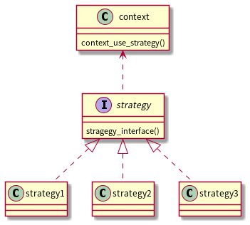

## 前言

参考：[C++设计模式 – 李建忠 – 视频](https://www.bilibili.com/video/BV1V5411w7qg?p=4)

推荐阅读：[策略 - 廖雪峰的官方网站](https://www.liaoxuefeng.com/wiki/1252599548343744/1281319606681634)

<br>

## 策略模式

策略模式：定义一系列的算法， 把他们一个个封装起来， 并且使它们可相互替换。 Strategy模式使算法可独立于使用它的客户而变化。 

策略模式与模版模式的区别：模版模式就是算法在父类中， 子类不会完全改写算法， 可以改写部分， 或称关键部分， 但整体的算法不变， 可以节省大量代码。 策略模式所有的算法均在子类中完成， 强调行为即算法的不同， 可以使程序更灵活。

* Strategy及其子类为组件提供了一系列可重用的算法，从而可以使得类型在运行时方便地根据需要在各个算法之间进行切换。
* Strategy模式提供了用条件判断语句以外的另一种选择，消除条件判断语句，就是在解耦合。含有许多条件判断语句的代码通常都需要Strategy模式。
* 如果Strategy对象没有实例变量，那么各个上下文可以共享同一个Strategy对象，从而节省对象开销。

<br>

## 策略模式类图

```c++
@startuml strategy
class context{
    context_use_strategy()
}

interface strategy{
    stragegy_interface()
}

class strategy1{}
class strategy2{}
class strategy3{}

context <.. strategy
strategy <|.. strategy1
strategy <|.. strategy2
strategy <|.. strategy3
@enduml
```

 

